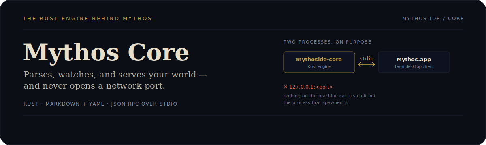

<div align="center">
  
</div>

# MythosIDE Core

[](./LICENSE.md)
[](https://github.com/Mythos-IDE/mythoside-core/discussions)
[](https://github.com/Mythos-IDE/mythoside-core/issues)

<p align="center">English · <a href="./README.TR.md">Türkçe</a></p>

**A writer's IDE for novelists building complex worlds.**

MythosIDE merges the structured, long-form writing approach of tools like
Scrivener with the intelligent, context-aware experience of a software IDE —
purpose-built for fantasy, sci-fi, and epic fiction writers who are tired of
stitching together five different apps to keep their world consistent.

> Status: early development. Expect rough edges. Contributions and feedback
> are very welcome.

## Why MythosIDE?

- **Structural hierarchy built for fiction** — Series → Book → Chapter →
  Scene, not a generic outliner you have to configure yourself.
- **Intelligent world-building** — type `@CharacterName` and get an instant
  contextual profile card without leaving your draft.
- **Local-first, always** — the source of truth is plain Markdown + YAML
  frontmatter on your disk. No lock-in, no "what happens to my novel if this
  company shuts down."
- **Fast under the hood** — a local SQLite (FTS5) index makes
  cross-referencing and relationship queries ("which clan appears in Chapter
  4?") instant, without ever becoming the source of truth itself.

## Repository layout

MythosIDE is split into a local client and a local server, in two repos:

- **This repo (`mythoside-core`)** — the engine. A standalone Rust crate
  (library + binary) with no Tauri or UI dependency at all: the manuscript
  data model, the Markdown+YAML file format, native filesystem watching, and
  entity operations (create/read/update/delete a character, scene, etc.). It
  runs as a small local server process, speaking a JSON-RPC-ish protocol over
  its own stdin/stdout — never a network port, so nothing on the machine can
  reach it but the process that spawned it.
- [`mythoside-ts`](https://github.com/Mythos-IDE/mythoside-ts) — the desktop
  client. A Tauri + TypeScript app that spawns this crate's binary as a
  managed sidecar process and proxies to it. All UI, editor, and rendering
  work happens there; this repo has none of it.

Why two processes instead of one binary: it keeps the actual writing/parsing
logic reusable and independently testable (`cargo test` here needs no UI, no
Tauri, no window), and it means the local-first guarantee is structural, not
just a promise — this crate never listens on a port, so there is no service
here a browser tab or another local process could probe.

## Tech stack

- Rust (this crate) — manuscript data model, Markdown+YAML parsing, file
  watching (`notify`), JSON-RPC server
- [Tauri](https://tauri.app/) + TypeScript ([`mythoside-ts`](https://github.com/Mythos-IDE/mythoside-ts)) — the desktop client
- SQLite + FTS5 for local indexing (planned, not started)
- A customized web-based text editor (ProseMirror/Monaco-based) (planned, in `mythoside-ts`)

## Getting started

```bash
cargo build   # builds the mythoside-core library + binary
cargo test    # runs the format/watcher/RPC test suite
```

This crate is consumed as a dependency (and its binary bundled as a sidecar)
by [`mythoside-ts`](https://github.com/Mythos-IDE/mythoside-ts) — that's
where you'd actually run the app. Track progress in
[Issues](../../issues) and [Discussions](../../discussions).

## License

MythosIDE is source-available under the
[Functional Source License, v1.1 (ALv2 Future License)](./LICENSE.md). In
short: you're free to use, read, modify, and self-host it for your own
writing — you just can't repackage it as a competing commercial product or
service. Each release converts to Apache 2.0 automatically two years after
publication.

"MythosIDE" and its logo are trademarks of the project and are not covered by
the license above — see [LICENSE.md](./LICENSE.md) for details.

## Contributing

See [CONTRIBUTING.md](https://github.com/Mythos-IDE/.github/blob/main/CONTRIBUTING.md) before opening a pull request.

## Security

See [SECURITY.md](https://github.com/Mythos-IDE/.github/blob/main/SECURITY.md) for how to report vulnerabilities.
